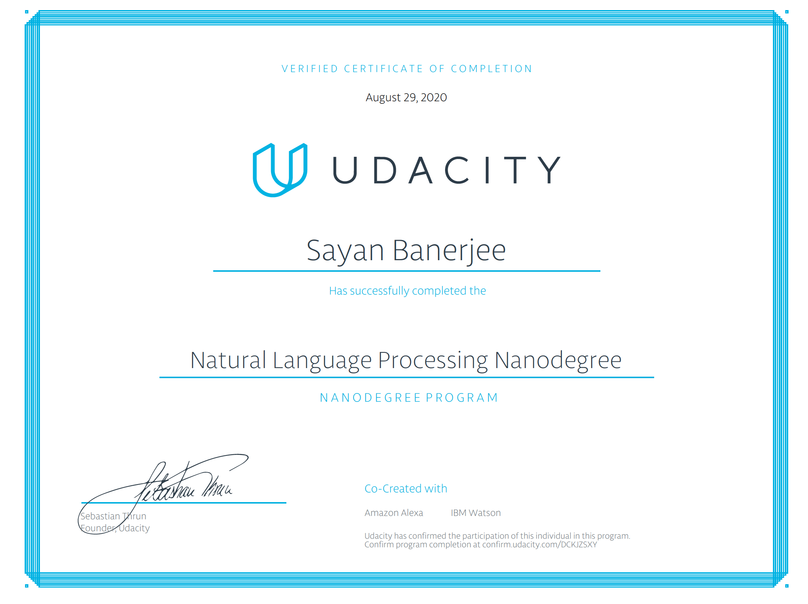

# Udacity Natural Language Processing Nanodegree

This repository contains the Exercises and my solutions to the NLP Nanodegree's Projects.

See https://www.udacity.com/course/natural-language-processing-nanodegree--nd892

Original source code retrieved from Udacity online environments and from the following Udacity repository:
- https://github.com/udacity/hmm-tagger
- https://github.com/udacity/AIND-VUI-Capstone

# Certificate

